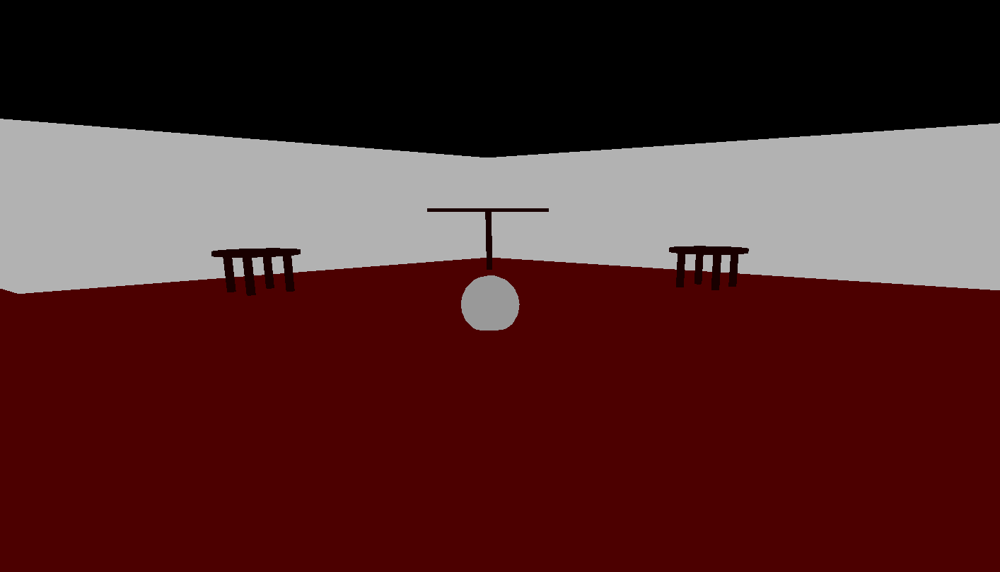
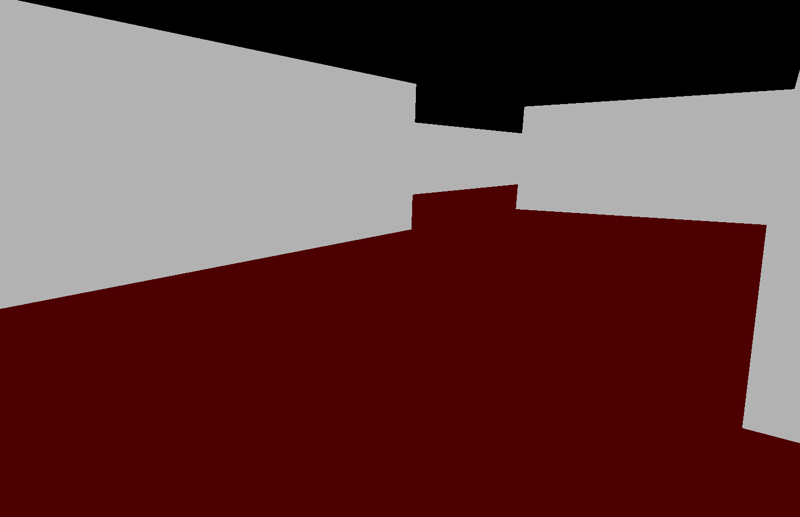

##  dungeon grawler (Labyrinth)

A labyrinth game written with C/C++. The keys "W", "A", "S and "D" can be used to control the game, where "W" is forward, "A" is left, "S" is back and "D" is right. The level is randomly selected at the start. There is a path that leads from a room to an exit. In the room there is a table and a ball. The ball can be picked up with "F".  "Space"  can be used to jump.     

The first picture shows the room, where the table is placed.

The second picture shows the ways, and walls of the game

